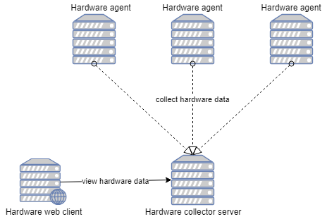

# spring-server-hardware-collector
Collect the hardware details of machines on lan for DSM Synology 

Features
----------------------------------
- Decoupled hardware data collection from the hardware data storage with REST 
- Spring boot all around
- Parsing and collecting of the hardware details with Bash 
- Vue.js web-client

Design
----------------------------------

Requirements
----------------------------------
- Java v8, Node.JS (compatible with DSM v6)
- Shell/git skills to run this app
- Compatible Linux 

Installation
----------------------------------
- Server: git clone ... in /opt -> Connect to Synology DSM/Control Panel/Security/Firewall/Create new rule 9390
- Agent: git clone ... in /opt
- Web-client: npm install

Run
----------------------------------
- Server: java -jar spring-server-hardware-collector-server.jar
- Agent: java -jar spring-server-hardware-collector-agent.jar --server.hardware.collector.port=9390 --server.hardware.collector.ip=[ip server] 
- Web-client: npm run dev 

open browser at: http://localhost:8088/#/service

Tests
----------------------------------
- Agent tested on XUbuntu 17.10 on Macbook 2012
- Spring-boot Server tested on Synology 5.2-5967 update 6 
- Webclient does not work with Synology 5.2-5967 update 6 (Node.JS package is not available)

To do 
----------------------------------
- [x] Commit the web-client
- [x] Deploy and run server in prod
- [x] Deploy and run agents on computers
- [ ] Complete run-agent.sh
- [ ] Configure agent to start on boot: crontab -e @reboot /opt/run-agent.sh
- [ ] Add bash commands for Mac

Changelog
-----------------------------------
